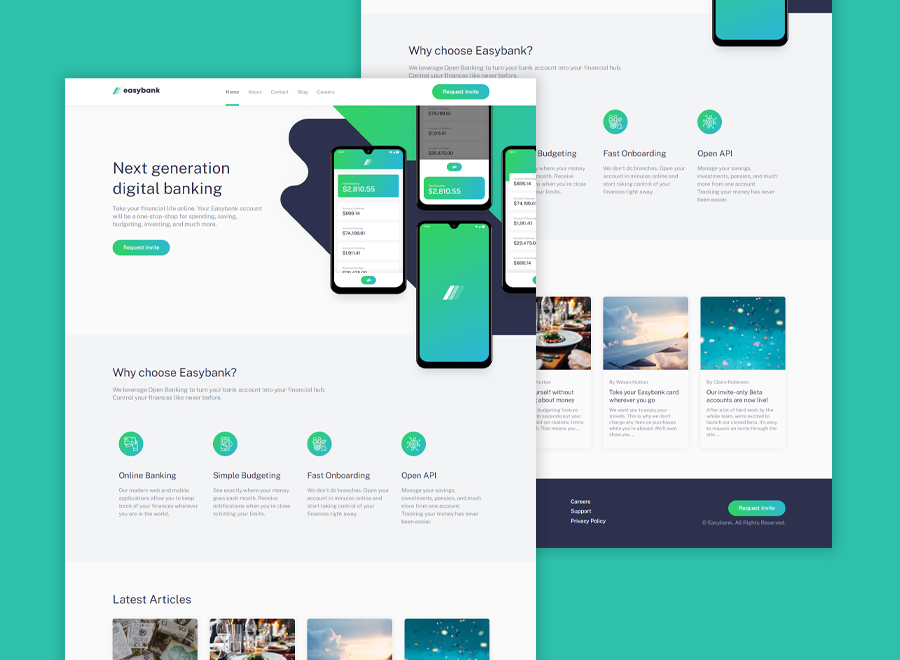

# Frontend Mentor - Easybank landing page solution

This is a solution to the [Easybank landing page challenge on Frontend Mentor](https://www.frontendmentor.io/challenges/easybank-landing-page-WaUhkoDN). Frontend Mentor challenges help you improve your coding skills by building realistic projects. 

## The challenge

Users should be able to:

- View the optimal layout for the site depending on their device's screen size
- See hover states for all interactive elements on the page

### Screenshot
 

Live Site URL: [Live Demo](https://kennyestrella-easybank-frontendmentor.netlify.app/)

Solution URL: [Solution URL](https://www.frontendmentor.io/solutions/html-5-css-javascript-filezilla-hostinger-nDihX7cKd)

### Used technologies
   